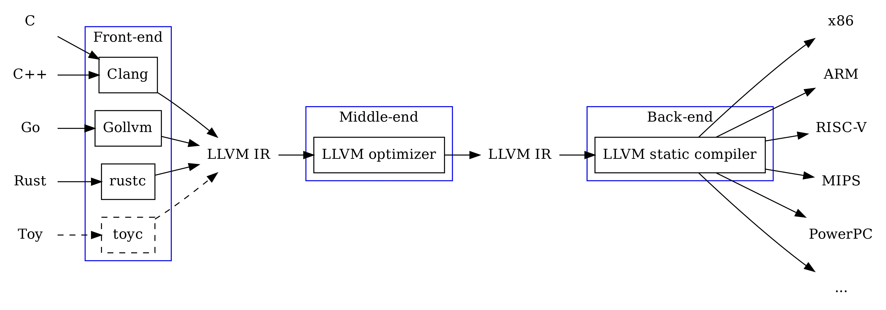
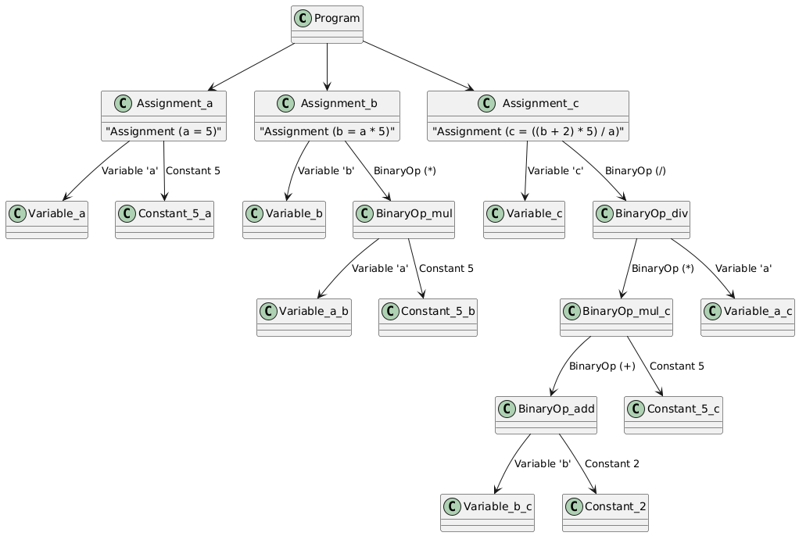
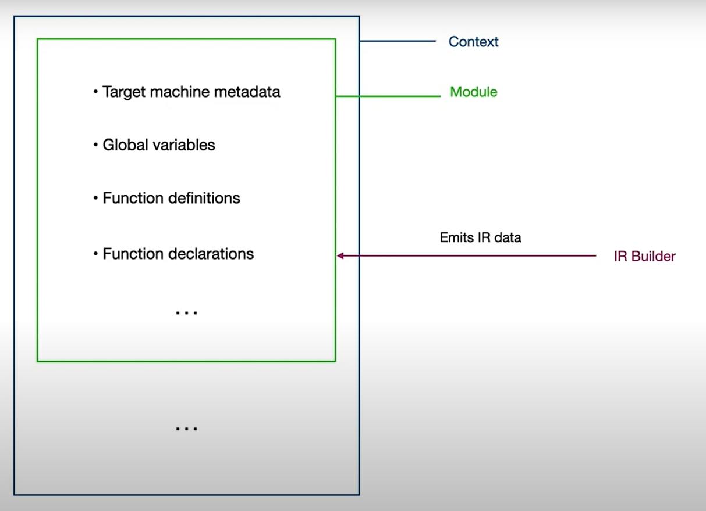
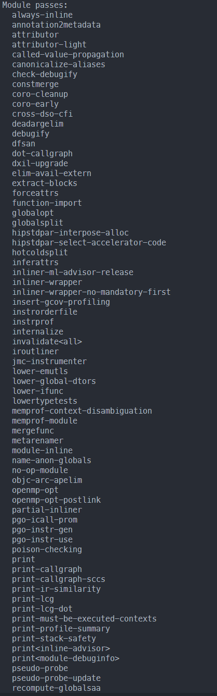
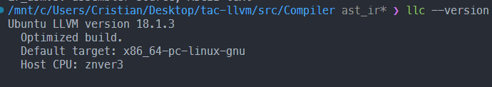
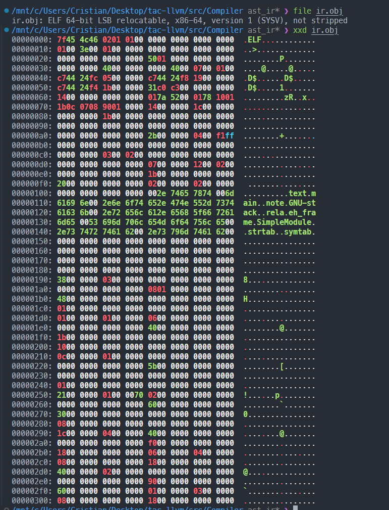
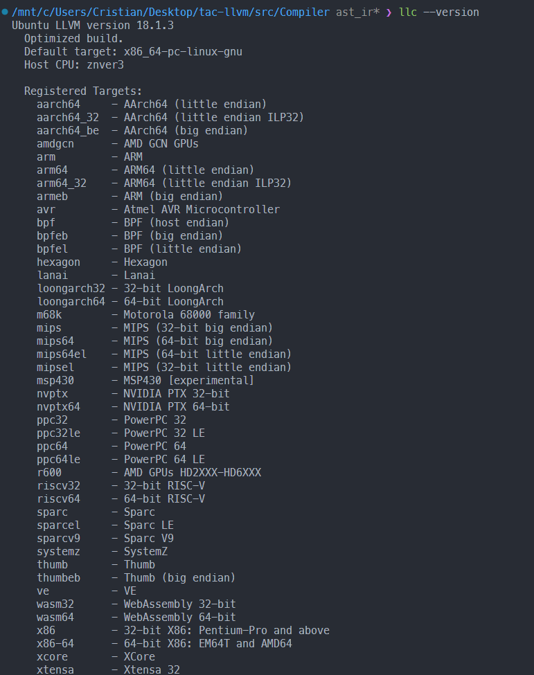
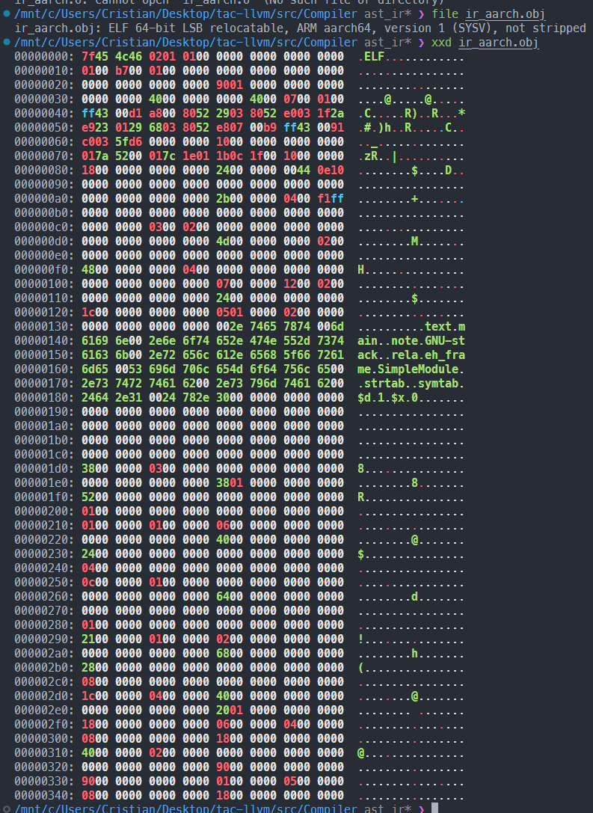

# LLVM

## Conținut

1. [LLVM. Prezentare](#1-prezentare-llvm)
1. [Generarea Codului LLVM IR](#2-generarea-codului-llvm-ir)
   1. [Prerequisites](#i-prerequisites)
   1. [AST](#ii-ast)
1. [Optimizări](#3-optimizări)
   1. [Elemente teoretice](#i-elemente-teoretice)
   1. [Elemente practice](#ii-elemente-practice)
1. [Generare cod mașină sau assembly code pentru arhitecturi diferite](#4-generare-cod-mașină-sau-assembly-code-pentru-arhitecturi-diferite)
   1. [Generare assembly code](#i-generare-assembly-code)
   1. [Generare cod mașină](#ii-generare-cod-mașină)
1. [clang](#5-clang)

### 1. Prezentare LLVM

---

LLVM, denumit fiind Low-Level Virtual Machine, deși autorii zis că acesta nu este un acronim, ci numele complet al proiectului. LLVM-ul este un framework pentru compilatoare extrem de versatil și modern, conceput pentru a oferi un set de instrumente pentru construirea de compilatoare și sisteme de procesare a limbajului robuste și de înaltă performanță. Conceput inițial în 2000 la Universitatea din Illinois, LLVM a evoluat într-un cadru standard industrial adoptat pe scară largă de organizații și dezvoltatori pentru flexibilitatea sa, designul modular și lanțul cuprinzător de instrumente.

**Caracteristici cheie**

- _Reprezentarea intermediară (IR)_: LLVM IR este un limbaj de programare independent de platformă, puternic tipizat și de nivel scăzut. Acesta servește ca abstracție de bază care permite o gamă largă de optimizări și transformări pe diferite arhitecturi hardware. Disponibil atât în formate citibile de către om, cât și în formate binare, (de exemplu, fișiere .ll și .bc), LLVM IR este esențial pentru portabilitatea și flexibilitatea sa.

- _Proiectare modulară și extensibilă_: LLVM este conceput ca o colecție de componente modulare, cum ar fi front-end, middle-end și back-end, fiecare gestionând diferite etape ale compilării. Această modularitate permite dezvoltatorilor să personalizeze și să extindă LLVM pentru a crea compilatoare specifice domeniului, pentru a integra procese de optimizare personalizate sau pentru a suporta noi arhitecturi hardware.

- _Suport multilingv și multiplatformă_: LLVM suportă o gamă largă de limbaje de programare prin diverse front-ends, cum ar fi Clang pentru C, C++ și Objective-C și alte proiecte pentru limbaje precum Rust, Swift, Julia și altele. Capacitatea sa de a viza arhitecturi multiple, inclusiv x86, ARM, RISC-V și GPU, îl face foarte adaptabil pentru diverse nevoi de dezvoltare.

- _Capacități de optimizare_: LLVM oferă un set bogat de procese de optimizare atât la nivelul IR, cât și la cel specific arhitecturii țintă. Acestea includ transformări avansate ce asigură performanța și eficiența codului.

**Arhitectura LLVM**  
LLVM urmează un pipeline de compilare în 3 faze:

1. _Front-End_: Front-end-ul convertește codul sursă de nivel înalt în LLVM IR. Diferite compilatoare front-end (precum Clang pentru C/C++, Swift, Rust) asigură analiza sintaxei, verificarea semantică și generarea codului pentru a produce IR.

2. _Middle-End_: Middle-end efectuează optimizări independente de țintă pe IR. Acesta aplică diverse transformări pentru a îmbunătăți performanța, a reduce dimensiunea codului și a simplifica structura programului, păstrând în același timp corectitudinea.

3. _Back-End_: Partea din spate translatează IR optimizat în cod de asamblare sau mașină specific arhitecturii țintă. Se mai ocupă de sarcini precum selectarea instrucțiunilor, alocarea registrelor și optimizările specifice țintă pentru a asigura o execuție eficientă.



<div class="page"></div>

### 2. Generarea Codului LLVM IR

---

#### I. Prerequisites

[ ] LLVM dev

```sh
sudo apt install llvm-dev
```

#### II. AST

> :pushpin: Reprezentarea AST (Abstract Syntax Tree) este un pas esențial în procesul de compilare atunci când folosim LLVM (sau orice alt framework de generare de cod intermediar). AST-ul servește drept punte între analiza inițială a codului sursă și generarea de cod executabil.Un AST (Abstract Syntax Tree) este o reprezentare ierarhică a structurii logice a unui program. Spre deosebire de codul sursă brut, AST-ul elimină detalii de suprafață, cum ar fi paranteze sau caractere de spațiu, păstrând doar structura semantică a programului.

> Pseudocod:

```c
Integer a = 5;
Integer b = a * 5;
Integer c = (b + 2) * 5 / a;
```

> AST este o structură arborescentă care reprezintă operațiunile și expresiile. Iată cum arată AST pentru acest cod:



#### Clasele de reprezentare a nodurilor AST

```c
#include <memory>
#include <vector>
#include <string>

// Base class for all AST nodes
class ASTNode {
public:
    virtual ~ASTNode() = default;
};

// Represents a variable
class Variable : public ASTNode {
public:
    std::string name;
    explicit Variable(const std::string& name) : name(name) {}
};

// Represents a constant (integer value)
class Constant : public ASTNode {
public:
    int value;
    explicit Constant(int value) : value(value) {}
};

// Represents a binary operation (e.g., +, -, *, /)
class BinaryOp : public ASTNode {
public:
    char op;
    std::unique_ptr<ASTNode> left;
    std::unique_ptr<ASTNode> right;

    BinaryOp(char op, std::unique_ptr<ASTNode> left, std::unique_ptr<ASTNode> right)
        : op(op), left(std::move(left)), right(std::move(right)) {}
};

// Represents an assignment (e.g., a = 5)
class Assignment : public ASTNode {
public:
    std::string variableName;
    std::unique_ptr<ASTNode> expression;

    Assignment(const std::string& variableName, std::unique_ptr<ASTNode> expression)
        : variableName(variableName), expression(std::move(expression)) {}
};

// Represents the program root
class Program : public ASTNode {
public:
    std::vector<std::unique_ptr<ASTNode>> statements;

    void addStatement(std::unique_ptr<ASTNode> statement) {
        statements.push_back(std::move(statement));
    }
};

```

> Pentru a crea IR (Reprezentare intermediara) mai intai trebuie sa construim arborele AST, in cazul nostru,
> o sa simplificăm implementare frontend-ului (parserul, analiza sintactica si semantica) si o sa trecem direct la
> crearea arborelui intr-o maniera hardcodată.

```c
std::unique_ptr<Program> buildAST() {
    auto program = std::make_unique<Program>();

    // a = 5
    program->addStatement(std::make_unique<Assignment>(
        "a",
        std::make_unique<Constant>(5)
    ));

    // b = a * 5
    program->addStatement(std::make_unique<Assignment>(
        "b",
        std::make_unique<BinaryOp>(
            '*',
            std::make_unique<Variable>("a"),
            std::make_unique<Constant>(5)
        )
    ));

    // c = (b + 2) * 5 / a
    program->addStatement(std::make_unique<Assignment>(
        "c",
        std::make_unique<BinaryOp>(
            '/',
            std::make_unique<BinaryOp>(
                '*',
                std::make_unique<BinaryOp>(
                    '+',
                    std::make_unique<Variable>("b"),
                    std::make_unique<Constant>(2)
                ),
                std::make_unique<Constant>(5)
            ),
            std::make_unique<Variable>("a")
        )
    ));

    return program;
}
```

<div class="page"></div>

> :pushpin: LLVM este o infrastructură modulară și flexibilă pentru compilatoare, iar în acest context, concepte precum module, context, funcții, și alte elemente joacă un rol esențial. Aceste componente definesc modul în care se organizează și se generează codul intermediar (IR). Să analizăm detaliat fiecare concept:



1. _LLVM Context_ `(llvm::LLVMContext)`  
   Contextul reprezintă spațiul de lucru în care LLVM păstrează toate datele legate de tipuri, constante și alte obiecte globale. Este o componentă crucială pentru a preveni conflictele și pentru a gestiona resursele.

   Roluri principale:

   Gestionarea unică a obiectelor: Tipurile și constantele sunt create și gestionate într-un context pentru a evita duplicarea.  
   Izolare între module: Poți avea mai multe contexte dacă generezi mai multe module separate.  
   Performanță: Contextul permite reutilizarea obiectelor comune (de exemplu, tipuri de date) pentru a reduce consumul de memorie.

2. _Module_ `(llvm::Module)`  
   Un modul reprezintă un program sau o unitate de traducere în LLVM. Este echivalent cu un fișier sursă în alte compilatoare și conține toate definițiile globale ale unui program.

   Conținutul unui modul:

   Funcții: Definiții și declarații de funcții.  
   Variabile globale: Date globale accesibile din toate funcțiile modulului.  
   Metadate: Informații adiționale, cum ar fi debug info sau optimizări.  
   Tipuri și constante: Obiecte definite pentru utilizare globală.  
   Roluri principale:

   Organizare: Reunește toate componentele necesare unui program.  
   Compilare: Modulul este unitatea de bază transmisă backend-ului pentru generarea de cod nativ.  
   Exemplu:

   ```c
   llvm::Module module("MyModule", context);
   ```

3. _Funcție_ `(llvm::Function)`  
   O funcție este o secvență de instrucțiuni IR care îndeplinește o anumită sarcină. În LLVM, funcțiile sunt componente de bază în cadrul unui modul.

   Atribute ale unei funcții:

   Tipul funcției (FunctionType): Descrie tipul valorii returnate și tipurile parametrilor.  
   Corpul funcției: Instrucțiunile efective, organizate în blocuri de bază.  
   Linkage: Modificatorii de acces (e.g., internal, external).  
   Blocuri de bază: Fiecare funcție este compusă din unul sau mai multe blocuri de bază (BasicBlock). fjdls
   Exemplu

   ```c
   auto* funcType = llvm::FunctionType::get(builder.getInt32Ty(), false);
   auto* mainFunc = llvm::Function::Create(
      funcType, llvm::Function::ExternalLinkage, "main", module);
   ```

4. _Bloc de bază_ `(llvm::BasicBlock)`  
   Un bloc de bază este o secvență de instrucțiuni consecutive, fără ramificații interne. Este unitatea fundamentală a controlului fluxului în LLVM.

   Atribute ale unui bloc:

   Instrucțiuni: Secvența efectivă de operații.
   Terminator: Fiecare bloc trebuie să se termine cu o instrucțiune de control al fluxului (e.g., ret, br).
   Exemplu:

   ```c
   auto* entryBlock = llvm::BasicBlock::Create(context, "entry", mainFunc);
   builder.SetInsertPoint(entryBlock);
   ```

5. _Instrucțiuni_ `(llvm::Instruction)`  
   Instrucțiunile reprezintă operațiile efective din IR. Fiecare instrucțiune aparține unui bloc de bază și este generată folosind IRBuilder.

   Tipuri de instrucțiuni:

   Aritmetice: add, sub, mul, sdiv.  
   Memorie: alloca, load, store.  
   Control al fluxului: br, ret, call.

   Exemplu:

   ```c
   llvm::Value* a = builder.CreateAlloca(builder.getInt32Ty(), nullptr, "a");
   llvm::Value* five = llvm::ConstantInt::get(context, llvm::APInt(32, 5));
   builder.CreateStore(five, a);
   ```

6. _Tipuri_ `(llvm::Type)`  
   Tipurile definesc structura datelor utilizate în instrucțiunile IR. LLVM este strict tipizat, deci toate operațiile trebuie să aibă tipuri compatibile.

   Tipuri comune:

   Scalar: i32 (integer pe 32 de biți), float, double.  
   Pointeri: i32\*.  
   Structuri: Agregate complexe.  
   Exemplu:

   ```c
   llvm::Type* int32Type = llvm::Type::getInt32Ty(context);
   ```

7. _Builder_ `(llvm::IRBuilder)`  
   IRBuilder este un utilitar pentru generarea de instrucțiuni în LLVM IR. Este folosit pentru a simplifica procesul de creare a instrucțiunilor și pentru a seta punctul curent de inserție.

   Roluri:

   Generarea instrucțiunilor: Permite crearea de instrucțiuni cu metode intuitive (e.g., CreateAdd, CreateLoad).  
   Gestionarea punctului de inserție: Definește unde sunt adăugate instrucțiunile în IR.

   Exemplu:

   ```c
   llvm::IRBuilder<> builder(entryBlock);
   auto* sum = builder.CreateAdd(aValue, five, "addtmp");
   ```

8. _Memorie_ (alloca, load, store)

   LLVM gestionează memoria explicit pentru variabile utilizând instrucțiuni IR:

   _alloca_: Alocă spațiu pentru o variabilă pe stiva.

   ```c
   auto* a = builder.CreateAlloca(builder.getInt32Ty(), nullptr, "a");
   ```

   _store_: Salvează o valoare în memoria alocată.

   ```c
   builder.CreateStore(five, a);
   ```

   _load_: Încarcă valoarea din memorie.

   ```c
   auto* aValue = builder.CreateLoad(a);
   ```

9. Relația între concepte  
   Context: Gestionează totul (tipuri, constante, etc.).  
   Module: Containere pentru funcții și variabile globale.  
   Funcții: Blocuri organizate de instrucțiuni, construite cu ajutorul builder-ului.  
   Blocuri de bază: Structuri pentru controlul fluxului.  
   Instrucțiuni: Operații individuale din cod.

#### Codul pentru generare LLVM IR

```c
#include <llvm/IR/IRBuilder.h>
#include <llvm/IR/LLVMContext.h>
#include <llvm/IR/Module.h>
#include <llvm/IR/Verifier.h>
#include <iostream>

// Function to generate LLVM IR from the AST
llvm::Value* generateIR(ASTNode* node, llvm::IRBuilder<>& builder, llvm::LLVMContext& context, llvm::Module& module, std::map<std::string, llvm::Value*>& namedValues) {
    if (auto* var = dynamic_cast<Variable*>(node)) {
        // Load a variable
        return builder.CreateLoad(builder.getInt32Ty(), namedValues[var->name]);
    } else if (auto* constant = dynamic_cast<Constant*>(node)) {
        // Return a constant value
        return llvm::ConstantInt::get(builder.getInt32Ty(), constant->value);
    } else if (auto* binOp = dynamic_cast<BinaryOp*>(node)) {
        // Process binary operation
        llvm::Value* left = generateIR(binOp->left.get(), builder, context, module, namedValues);
        llvm::Value* right = generateIR(binOp->right.get(), builder, context, module, namedValues);
        switch (binOp->op) {
            case '+': return builder.CreateAdd(left, right, "addtmp");
            case '*': return builder.CreateMul(left, right, "multmp");
            case '/': return builder.CreateSDiv(left, right, "divtmp");
            default: throw std::runtime_error("Unknown binary operator");
        }
    } else if (auto* assignment = dynamic_cast<Assignment*>(node)) {
        // Process assignment
        llvm::Value* value = generateIR(assignment->expression.get(), builder, context, module, namedValues);
        builder.CreateStore(value, namedValues[assignment->variableName]);
        return value;
    }
    throw std::runtime_error("Unknown AST node type");
}

int main() {
    // Setup LLVM components
    llvm::LLVMContext context;
    llvm::Module module("SimpleModule", context);
    llvm::IRBuilder<> builder(context);

    // Define variables map
    std::map<std::string, llvm::Value*> namedValues;

    // Create the main function
    llvm::FunctionType* funcType = llvm::FunctionType::get(builder.getInt32Ty(), false);
    llvm::Function* mainFunc = llvm::Function::Create(funcType, llvm::Function::ExternalLinkage, "main", module);

    // Create the entry basic block
    llvm::BasicBlock* entryBlock = llvm::BasicBlock::Create(context, "entry", mainFunc);
    builder.SetInsertPoint(entryBlock);

    // Allocate variables
    namedValues["a"] = builder.CreateAlloca(builder.getInt32Ty(), nullptr, "a");
    namedValues["b"] = builder.CreateAlloca(builder.getInt32Ty(), nullptr, "b");
    namedValues["c"] = builder.CreateAlloca(builder.getInt32Ty(), nullptr, "c");

    // Build the AST
    auto program = buildAST();

    // Traverse the AST and generate IR
    for (auto& stmt : program->statements) {
        generateIR(stmt.get(), builder, context, module, namedValues);
    }

    // Return 0
    builder.CreateRet(llvm::ConstantInt::get(builder.getInt32Ty(), 0));

    // Verify the module and print IR
    if (llvm::verifyModule(module, &llvm::errs())) {
        std::cerr << "Error: Module verification failed\n";
        return 1;
    }

    module.print(llvm::outs(), nullptr);
    return 0;
}
```

### 3. Optimizări

---

#### I. Elemente teoretice

Faza intermediară(middle-end) a framework-ului de compilatoare LLVM este cea în care au loc majoritatea transformărilor de optimizare. Această etapă procesează reprezentarea intermediară (IR) a codului, efectuând transformări independente de arhitectura mașinii. Acestea sunt menite să îmbunătățească performanța și să reducă utilizarea resurselor. Optimizările Middle-end în LLVM IR valorifică formatul său structurat de nivel înalt, care păstrează detaliile esențiale ale programului, făcând abstracție de complexitățile specifice mașinii.

Middle-end-ul LLVM se bazează pe o infrastructură sofisticată de **_passes_** pentru a implementa optimizări și analize. Acestea se împart în două mari categorii: **analysis passes** și **transformation passes**, fiecare servind unui scop specific în îmbunătățirea sau pregătirea reprezentării intermediare (IR) pentru prelucrarea ulterioară.

**Analysis passes** sunt funcții care colectează și furnizează informații despre LLVM IR fără a-l modifica direct. Acestea servesc drept bază pentru procesele de transformare(_transformation passes_), permițându-le să ia decizii pe baza proprietăților programului. Acest proces de analiza e ușor din punct de vedere al calculului în comparație cu transformările și adesea își memorează rezultatele pentru a evita calculele redundante.

**Transformation passes** modifică direct IR pentru a-l optimiza. Aceste procese se bazează pe informațiile din procesele de analiză pentru a asigura corectitudinea și eficiența transformărilor lor. Ele sunt responsabile pentru îmbunătățirea performanței, reducerea dimensiunii sau simplificarea structurii codului.

Middle-end-ul LLVM oferă o multitudine de optimizări încorporate care pot fi aplicate la momentul compilării, la momentul legăturii(lnker) sau la momentul rulării (în cazul compilării JIT (Just-in-Time)).

Lista cu optimizări: [https://llvm.org/docs/Passes.html](https://llvm.org/docs/Passes.html)

#### II. Elemente practice

Optimizarea codului LLVM IR poate fi predefinită, cât și dezvoltată manual de programator. În cadrul exemplului de mai jos va fi prezentată o soluție predefinită, utilizând un instrument din infrastructura LLVM - `opt`.

Utilizând instrumentul de optimizare se va transforma versiunea neoptimizată, human-readable a fișierului ce conține codul LLVM IR într-o altă versiune optimizată, human-readable. `ir.ll` &rarr; `ir_opt.ll`.

```bash
opt -f -S ir.ll -stats -print-passes -o ir_opt.ll
```

> Documentatie instrument `opt`: [https://llvm.org/docs/CommandGuide/opt.html](https://llvm.org/docs/CommandGuide/opt.html)

Datorită parametrului `-print-passes`, obținem o listă cu toată trecerile. Lista este una foarte mare, deci în exemplul următor sunt prezentate doar o parte din ele. Pentru a vedea toată lista, accesați [https://github.com/wDevCristian/tac-llvm](https://github.com/wDevCristian/tac-llvm) și vedeți fisierul `Module passes.txt`.



Codul sursă din `ir.ll`

```ll
; ModuleID = 'SimpleModule'
source_filename = "SimpleModule"

define i32 @main() {
entry:
  %a = alloca i32, align 4
  %b = alloca i32, align 4
  %c = alloca i32, align 4
  store i32 5, ptr %a, align 4
  %0 = load i32, ptr %a, align 4
  %multmp = mul i32 %0, 5
  store i32 %multmp, ptr %b, align 4
  %1 = load i32, ptr %b, align 4
  %addtmp = add i32 %1, 2
  %multmp1 = mul i32 %addtmp, 5
  %2 = load i32, ptr %a, align 4
  %divtmp = sdiv i32 %multmp1, %2
  store i32 %divtmp, ptr %c, align 4
  ret i32 0
}
```

Codul sursă din `ir_opt.ll`

```ll
; ModuleID = 'ir.ll'
source_filename = "SimpleModule"

; Function Attrs: mustprogress nofree norecurse nosync nounwind willreturn memory(none)
define noundef i32 @main() local_unnamed_addr #0 {
entry:
  ret i32 0
}

attributes #0 = { mustprogress nofree norecurse nosync nounwind willreturn memory(none) }

```

Drept rezultat, instrumentul de optimizare consideră eliminarea calculelor, din moment ce functia returneaza intr-un final valoarea `0`, iar variabilele nu sunt utilizate în altă parte.

<div class="page"></div>

### 4. Generare de cod mașină sau assembly code pentru arhitecturi diferite

---

Generarea codului este etapa finală a procesului de compilare, în care reprezentarea intermediară optimizată (IR) este translatată în codul de asamblare sau mașină specific arhitecturii acestuia.

Generarea codului în limbaj de asamblare sau cod mașină e posibilă prin utilizarea compilatorului de system LLVM - `llc`.

Documntație instrument `llc`: [https://llvm.org/docs/CommandGuide/llc.html](https://llvm.org/docs/CommandGuide/llc.html)

#### I. Generare assembly code

> În cazul în care nu e specificată arhitectura pentru care se generează cod mașină sau assembly code, se utilizează arhitectura computerului pe care este rulat. Datele acestea sunt cunoscute de `llc` > 

> De dragul exemplului voi lua varianta neoptimizată a fișierului ce conține LLVM IR, iar compilarea o voi face fără a utiliza optimizările compilatorului `llc`. Fisierul .s rezultat va conține mai multe date, iar comparația dintre reprezentarea IR și codul de asamblare va fi mai evidentă.

```bash
llc -O0 ir.ll -filetype=asm -o ir_asm.s
```

Conținutul fișierului ir_asm.s

```asm
	.text
	.file	"SimpleModule"
	.globl	main                            # -- Begin function main
	.p2align	4, 0x90
	.type	main,@function
main:                                   # @main
	.cfi_startproc
# %bb.0:                                # %entry
	movl	$5, -4(%rsp)
	imull	$5, -4(%rsp), %eax
	movl	%eax, -8(%rsp)
	movl	-8(%rsp), %eax
	addl	$2, %eax
	imull	$5, %eax, %eax
	cltd
	idivl	-4(%rsp)
	movl	%eax, -12(%rsp)
	xorl	%eax, %eax
	retq
.Lfunc_end0:
	.size	main, .Lfunc_end0-main
	.cfi_endproc
                                        # -- End function
	.section	".note.GNU-stack","",@progbits

```

#### II. Generare cod mașină

```bash
llc ir.ll -filetype=obj -o ir.obj
```



> Pentru a modifica arhitectura pentru care e generat codul mașină se utilizează argumentul `-march`.

> Pentru a vedea pe ce arhitecturi poate fi generat codul, se utilizează comanda: `llc --version`



Exemplul pentru generarea de cod mașină pentru architectura ARM64.

```bash
llc ir.ll -march=aarch64 -filetype=obj -o ir_aarch.obj
```



<div class="page"></div>

### 5. Clang

---

Clang este un compilator care face parte din infrastructura LLVM, proiectat să ofere o alternativă modernă și performantă
compilatorului GNU Compiler Collection (GCC). Principalele sale caracteristici includ:

- Un frontend de compilare pentru C, C++ și Objective-C
- Parte integrală a proiectului LLVM
- Proiectat cu un design modular și extensibil
- Oferă diagnostice de eroare foarte precise și ușor de înțeles

Clang funcționează ca un front-end care transformă codul sursă într-o reprezentare intermediară (IR) LLVM,
ce poate fi ulterior procesată de alte componente ale infrastructurii LLVM.
Etapele principale includ:

1. Analiza Lexicală și Sintactică
1. Generarea IR

Exemple de utilizare:

```sh
# Compilare simplă
clang program.c -o program

# Compilare cu optimizări
clang -O2 program.c -o program

# Generare fișier intermediar LLVM
clang -emit-llvm program.c
```

# Diferențe față de GCC: Comparație Tehnică

| Caracteristică      | Clang              | GCC                   |
| ------------------- | ------------------ | --------------------- |
| Viteză de compilare | Mai rapidă         | Mai lentă             |
| Utilizare memorie   | Mai eficientă      | Mai puțin eficientă   |
| Mesaje de eroare    | Detaliate și clare | Mai puțin descriptive |
| Modularitate        | Design modular     | Design monolitic      |
| Suport IDE          | Foarte bun         | Limitat               |
